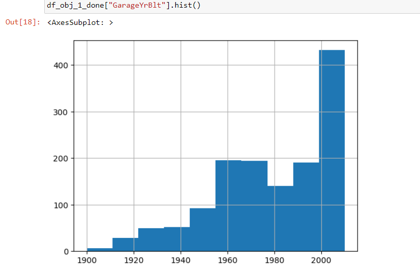
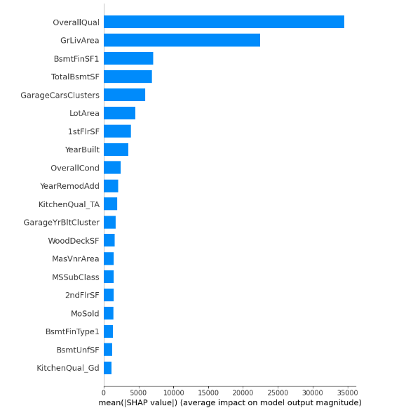

# Predicting house prices using XGBRegressor (Kaggle training competition: https://www.kaggle.com/competitions/house-prices-advanced-regression-techniques/)

## Authors

Nikolas Margos <br></br>
https://github.com/NMARGOS <br></br>
https://www.linkedin.com/in/nikolasmargos/ <br></br>

## Business value /usage in real life
Be able to understand the characteristics that influence a house price, and predict within a reasonable margin of error the sales price to identify undervalued properties

## Description
The goal was to use a model to predict the final sales price of a house

The file contains the raw code used to process and clean the data, as well as understand factors influencing the final price and hyperparameter tuning.

## Getting Started

### Dependencies

There is enviroment_listings.yml in the repo with all the necessary dependencies.

A) Explore the dataset and read the reference to understand the columns. 
<div align="center">
  <br>
  <sup>Sample display of image in HTML format <sup>
</div>
      <br></br>
B) Clean the data as much as possible by droppign rows or imputing missing values
<br></br>
C) Run a regressor for a baseline reading
<br></br>
D) Use hyperopt as well as grid search to further parameter tune
<br></br>
E) Use shap to understand the columns most important in reducing the error
<div align="center">
  <br>
  <sup>Sample display of image in HTML format <sup>
</div>
      <br></br>    

## Model choice

An XGB Regressor was used to predict the house prices with hyperparameters tuned using grid search and hyperopt. 
## Metric to track

The metrics attempted to minimize were the mean absolute error and root mean squared error

## Final Model Choice and Output

The model with a RSME of ~29,000 and absolute error of ~16,000 (mean house price was 180,000) achieving a rank of ~1400 out of more than 4200 user submissions


```python

```


```python

```
